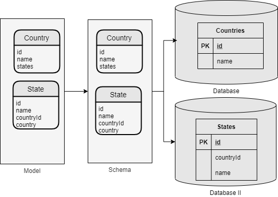

# Lab 04

In this laboratory we will see:

- How to insert data from a file to more than one table.
- how to extend entities using abstract entities
- how to define a schema that works with entities in different databases
- how to run a bulkinsert on entities in different databases
- how to export and import entity data in different databases

## Schema diagram

This schema has two entities that are in different databases.



The database attribute is used in the entity to be able to specify that an entity is in a database other than the default of the schema.

```yaml
      - name: States
        database: mydb2
```

## Pre requirements

### Create database for test

Create file "docker-compose.yaml"

```yaml
version: '3'
services:
  mysql:
    container_name: lambdaorm-mysql
    image: mysql:5.7
    restart: always
    environment:
      - MYSQL_DATABASE=test
      - MYSQL_USER=test
      - MYSQL_PASSWORD=test
      - MYSQL_ROOT_PASSWORD=root
    ports:
      - 3306:3306
  postgres:
    container_name: lambdaorm-postgres  
    image: postgres:10
    restart: always
    environment:
      - POSTGRES_DB=test
      - POSTGRES_USER=test
      - POSTGRES_PASSWORD=test
    ports:
      - '5432:5432'
```

Create MySql database for test:

```sh
docker-compose up -d
```

Create user and set character:

```sh
docker exec lambdaorm-mysql  mysql --host 127.0.0.1 --port 3306 -uroot -proot -e "ALTER DATABASE test CHARACTER SET utf8 COLLATE utf8_general_ci;"
docker exec lambdaorm-mysql  mysql --host 127.0.0.1 --port 3306 -uroot -proot -e "GRANT ALL ON *.* TO 'test'@'%' with grant option; FLUSH PRIVILEGES;"
```

### Install lambda ORM CLI

Install the package globally to use the CLI commands to help you create and maintain projects

```sh
npm install lambdaorm-cli -g
```

## Test

### Create project

will create the project folder with the basic structure.

```sh
lambdaorm init -w lab_04
```

position inside the project folder.

```sh
cd lab_04
```

### Complete Schema

In the creation of the project the schema was created but without any entity.
Add the Country entity as seen in the following example

```yaml
app:
  src: src
  data: data
  models: models
  defaultDatabase: mydb
databases:
  - name: mydb
    dialect: mysql
    schema: countries
    connection:
      host: localhost
      port: 3306
      user: test
      password: test
      database: test
  - name: mydb2
    dialect: postgres
    connection:
      host: localhost
      port: 5432
      user: test
      password: test
      database: test
schemas:
  - name: countries
    entities:
      - name: Positions
        abstract: true
        properties:
          - name: latitude
            length: 16
          - name: longitude
            length: 16
      - name: Countries
        extends: Positions
        primaryKey: ["iso3"]
        uniqueKey: ["name"]
        properties:
          - name: name
            nullable: false
          - name: iso3
            length: 3
            nullable: false
        relations:
          - name: states
            type: manyToOne
            composite: true
            from: iso3
            entity: States
            to: countryCode
      - name: States
        extends: Positions
        database: mydb2
        primaryKey: ["id"]
        uniqueKey: ["countryCode", "name"]
        properties:
          - name: id
            type: integer
            nullable: false
          - name: name
            nullable: false
          - name: countryCode
            nullable: false
            length: 3
        relations:
          - name: country
            from: countryCode
            entity: Countries
            to: iso3
```

### Update

```sh
lambdaorm update
```

the model will be created inside file src/models/countries/model.ts .

### Sync

```sh
lambdaorm sync
```

It will generate:

- the Counties table is created in database test on MySql
- the States table is created in database test on Postgres
- status file "mydb-state.json" in the "data" folder.

### Popuplate Data

then we execute

```sh
lambdaorm run -e "Countries.bulkInsert().include(p => p.states)" -d ./data.json -n mydb
```

test:

```sh
lambdaorm run -e "Countries.page(1,10).include(p => p.states)" -n mydb
```

### Export data from mydb

```sh
lambdaorm export
```

### Delete data

```sh
lambdaorm run -e "States.deleteAll()" 
lambdaorm run -e "Countries.deleteAll()" 
```

### Import data

```sh
lambdaorm import -s ./mydb-export.json
```

test:

```sh
lambdaorm run -e "Countries.page(1,10).include(p => p.states)"
```

### Drop

remove all tables from the schema and delete the state file, mydb-state.json

```sh
lambdaorm drop
```

## End

### Remove database for test

Remove MySql database:

```sh
docker-compose down
```
